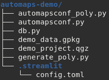

# Getting Started with autoMaps

Work through this tutorial to get your feets wet with autoMaps. 

For further details on using autoMaps, please refer to the 
[User Guide](user_guide/overview.md).

## Installation

!!! warning

    Only tested on Ubuntu 20.04! Installation on Windows is experimental.

Follow the [Installation instructions](user_guide/installation.md) in the User Guide.


## Creating a demo project
To get a feeling for the functionality and configuration of autoMaps you should first
create a demo project.

On the command line, `cd` into a directory where you want to place the demo project.
Then run the following command:
```bash
automaps init-demo
``` 

Then start the demo app by running the following command:
```bash
automaps run dev -c ./automaps-demo/automapsconf.py
``` 

Open up `http://127.0.0.1:8506/automaps-demo/` in your browser, and you'll see
the frontend of the demo project being displayed:


Choose a district and a file format, click on `Create map` and then on `Download` to get
your first automatically generated map.

!!! tip

    If you encounter problems running the demo app, this might be because of a wrong
    setting in `automaps-demo/automapsconf.py`. Try to change the option 
    `QGIS_INSTALLATION_PATH` to the correct path for your system. The path can be 
    determined by opening up the QGIS GUI and running `QgsApplication.prefixPath()` 
    in the Python console.

## Exploring the demo project
The demo project consists of the following files:

  

### Geodata (`demo_data.gpkg`, `demo_project.qgz`)
Let's take a look at the geodata first. It is stored in the 
[GeoPackage](https://www.geopackage.org/) `demo_data.gpkg` and used in the 
[QGIS](https://qgis.org) project `demo_project.qgz`. Open the `qgz` file with QGIS
and explore it. You'll discover, that it consists of only a few main elements.

It has two layers: 


 * __districts__: a polygon layer holding the geometries and some attributes of the 23
 districts of Vienna, Austria. The attribute `NAMEK` is used to provide the options
 for the frontend's drop down menu called `District name`. During the map 
 creation process, the __districts__ layer is filtered to only show the selected
 district.
 * __OpenStreetMap__: used as basemap.

The project also consists of a print layout called __poly__, which has three elements:


* The main map, called `Map 1`. During the map creation process, the map view
is updated to zoom to the selected district.
* A label with the content `[% map_get(@data, 'District name') %]`. During the
map creation process, it is updated to hold the selected value of the drop down menu
called `District name`.
* Another label holding the data source information. This is just some static text.

### The streamlit configuration (`./streamlit/config.toml`)
autoMaps uses [Streamlit](https://streamlit.io/) as its frontend. Streamlit can be
configured using the `config.toml` file, as described in the 
[docs](https://docs.streamlit.io/library/advanced-features/configuration). In the case 
of our demo project, it looks like this:
``` ini
[server]
port = 8506
baseUrlPath = "automaps-demo"
``` 

### The main configuration (`automapsconf.py`, `automapsconf_poly.py`, `db.py`)

The main configuration is defined in a Python file, which typically is called 
`automapsconf.py` and located in the same directory as `app.py`. For the demo project
this configuration is split into three files, two of them imported into the main file
`automapsconf.py`. This helps to keep everything clearly arranged and to store
database credentials in a dedicated file, which can be kept locally in version control
scenarios (e.g. by gitignoring it). This structure is recommended as best practice for
your own projects. For more information take a look at the
[User Guide](user_guide/main_config.md).

`automapsconf.py` requires some mandatory config options and supports a list of optional
config options. At this point, we will focus only on two of them, `db` and
`MAPTYPES_AVAIL`:

The configuration option `db` is necessary to connect to your project's (geo)database
and thus to present the available options in the frontend (like the values of the
drop down menu `District name`). It has to be a dictionary which can be converted
into an [SQLAlchemy `URL` object](https://docs.sqlalchemy.org/en/14/core/engines.html#sqlalchemy.engine.URL).
For the demo project, only `drivername` and `database` are set to point to the 
SQLite database which is part of the geopackage `demo_data.gpkg`:
``` python
db = {
    "drivername": "sqlite",
    "database": "demo_data.gpkg"
}
```

The configuration option `MAPTYPES_AVAIL` is a list of `MapType` objects:
``` python
MAPTYPES_AVAIL = [maptype_poly]
``` 

`MapType` objects serve as main autoMaps elements and help to structure your project. 
Each `MapType` is tied to one or more QGIS print layouts (which define the looks of the 
map) as well as to a single `MapGenerator` (which defines the processing steps). Take a
look at the code in `automapsconf_poly.py` which defines the `MapType` object 
`maptype_poly` and compare it with the UI elements of the demo project's frontend:
``` python
import streamlit as st

from automaps.maptype import MapType
from automaps.selector import SelectorSimple, SelectorSQL
from generate_poly import MapGeneratorPoly

maptype_poly = MapType(
    name="Districts in Vienna",
    description="Choose a district and get your map!",
    ui_elements=[
        SelectorSQL(
            "District name",
            """
            select distinct NAMEK
            from districtborder
            order by NAMEK""",
            st.selectbox,
            widget_args={
                "help": "Choose your district!"
            },
            no_value_selected_text="Choose district ...",
        ),
        
        SelectorSimple(
            "File Format",
            ["PDF", "PNG", "SVG"],
            st.radio,
            exclude_from_filename=True,
            use_for_file_format=True,
        ),
    ],
    print_layout="poly",
    map_generator=MapGeneratorPoly,
)
```

You can see that the main part of the object initialization is the list passed to 
the `ui_elements` argument. It holds two `Selector` objects, which define the available
options in the frontend and serve as connection to the backend, passing the selected
values as a dictionary called `data` to the processing machinery. Check the "Debug" 
box in the frontend to see a representation of the `data` object:


### The processing configuration (`generate_poly.py`)
The `data` dictionary is consumed by `MapGeneratorPoly`, a class of type `MapGenerator`,
defined in `generate_poly.py`:

``` python
from collections import OrderedDict

from automaps.generators.base import MapGenerator, Step


class MapGeneratorPoly(MapGenerator):
    name = "Districts in Vienna"

    def _set_steps(self):
        self.steps = OrderedDict(
            {
                "Initialize project": Step(self.init_project, 1),
                "Filter layers": Step(self.filter_layers, 1),
                "Zoom to extent": Step(self.set_extent, 1),
                "Export map": Step(self.export_layout, 5),
            }
        )

    def init_project(self):
        self._init_layers()
        self._set_project_variable(
            "data", self.data
        )
        self._set_map_layer_visibility("districts", True)
        self._set_map_layer_visibility("OpenStreetMap", True)

    def filter_layers(self):
        self._set_map_layer_filter_expression(
                "districts", f"NAMEK = '{self.data['District name']}'"
        )

    def set_extent(self):
        self._zoom_map_to_layer_extent(
            "Map 1", self._get_map_layer("districts")
        )

    def export_layout(self):
        self._export_print_layout()
        self.step_data.project.write("./poly_out.qgz")
        del self.step_data.project
```

The `MapGenerator` defines the processing steps which are required to generate the
desired map, based on (1) the user selected options (stored in the `self.data` 
property), and (2) on the layers, stylings, print layouts etc. in the QGIS project.

Each `MapGenerator` consists of at least one, but possibly dozens of processing steps. 
The demo project's `MapGeneratorPoly` consists of four. They are declared in the 
`_set_steps()` method and defined in the other corresponding methods. How to structure 
your `MapGenerator` depends on your use case. Just take notice, that the progress of a 
processing task is visualized in the frontend as a progress bar. You can call your 
methods however you want.

So what happens here?

* `init_project()` initializes all map layers, making them invisible and removing all
filter conditions. It copies the `self.data` dictionary as project variable into the 
QGIS project and then turns on the required layers.
* `filter_layers()` takes the user selected value of the `Selector` labeled
`District name` (the drop down menu) to set a filter expression for the `districts`
layer.
* `set_extent()` zooms `Map 1` of our print layout `poly` to the now filtered extent
of the `districts` layer.
* `export_layout()` finally exports the created map in the desired file format (PDF, PNG
or SVG). It also writes the specific QGIS project file to the defined location, which
can be handy for debugging your own autoMaps projects. Take a look at `poly_out.qgz` in
QGIS, inspect the filter expressions and the `poly` print layout!

The step methods use various helper methods, inherited from the `MapGenerator` base 
class, such as `_set_map_layer_visibility()` or `_export_print_layout()`. Take a look
at the [`User Guide`](user_guide/map_generator.md) for a list of these helper
methods. You don't have to use them in your own projects, you could directly go for
the respective `PyQGIS`-calls instead. But they save you a lof of typing for the most
common tasks.

After running through all processing steps, the download button shows up on the 
frontend and the map is ready to be used.

Feel free to play around with the demo project to get better acquainted with the overall
structure of an autoMaps project.

For further details on using autoMaps, please refer to the 
[User Guide](user_guide/overview.md)!

## Creating your own project

You can now go back to the command line and create your first autoMaps project from
scratch. Run the following command:

```bash
automaps init-project PROJECT_NAME
```

Replace `PROJECT_NAME` with the desired name.

This will create a new directory with some stub files as starting point for your own
project. Maybe you like to start with editing `automapsconf.py` which includes some
hopefully helpful comments to get you started.
