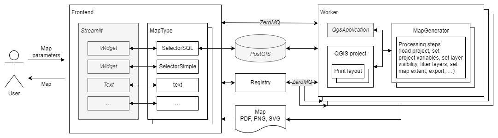

autoMaps combines various building blocks to a scalable system:

## Map generation: QGIS

[QGIS](https://qgis.org) is used for map generation, based on generic layouts, which act as templates. The
creation process is controlled via pyQGIS, QGIS’ Python API. This process typically
involves setting layer visibility, defining filter expressions or the map extent,
setting texts such as headings or source information, and, finally, the export as PDF,
PNG or SVG file.

## Frontend: Streamlit

Users can set the map type and its parameters via a web frontend, which was implemented
using the Python package [Streamlit](https://streamlit.io). During this process,
database queries are continuously performed to populate the interactive elements of the
frontend (e.g., selection lists).

## Messaging: ZeroMQ

To make the system multi-user capable and to enable asynchronous generation of maps, a
messaging architecture consisting of frontend processes, a central registry and several
worker processes was designed and implemented using the messaging library
[ZeroMQ](https://zeromq.org/). The workers can process map requests independently of
each other in parallel. The registry keeps track of the available workers and their
states, thus ensuring efficient allocation of tasks.

## Database: PostGIS, GeoPackage, ...

The input data can be stored in a [PostGIS database](https://postgis.net/), a
[GeoPackage](https://www.geopackage.org/), or other sources compatible with QGIS.
